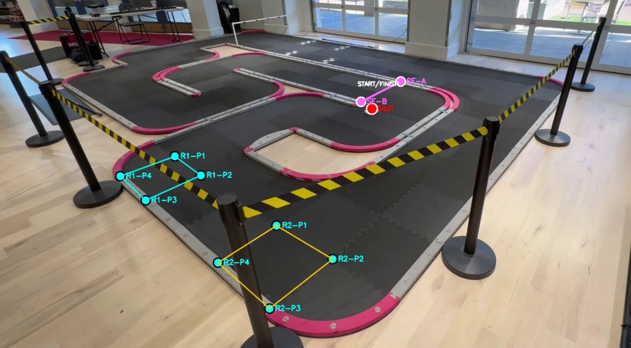

# RC Track Analyzer

A computer vision tool for analyzing RC car track performance using Meta's **SAM2** for object segmentation and tracking—no GPS device required.

## Motivation

Installing GPS devices on small-scale RC cars for performance overlay (like 1:1 race cars) is impractical. This project solves that by:
- Using **SAM2** to track and segment RC cars from video footage
- Supporting **side-mounted cameras** with homography transformation for birds-eye-view (BEV) conversion
- Computing trajectories, speed, and acceleration metrics
- Detecting **lap times** via a virtual start/finish line

Simply place your camera on the side of the track, mark reference points, and let the analyzer do the rest.

## Features

- **Point-and-click object selection** – Click on RC cars to track
- **Homography transformation** – Convert side-view footage to birds-eye-view
- **Start/Finish line & lap detection** – Draw a virtual line on the frame; lap times, best lap, and averages are computed automatically
- **Per-lap filtering** – View trajectory plots and animations for a specific lap
- **Kinematics analysis** – Speed, acceleration, and distance metrics
- **Trajectory visualization** – Color-coded acceleration/braking zones
- **Data export** – JSON and CSV formats for further analysis
- **Multi-user web UI** – Gradio interface with login/registration and per-user data isolation

## Quick Start

### Installation

```bash
git clone https://github.com/your-username/rc-track-analyzer.git
cd rc-track-analyzer
pip install -r requirements.txt
```

### Usage

**Web UI (recommended):**
```bash
python main.py
```

**With options:**
```bash
python main.py --port 8080 --model facebook/sam2.1-hiera-small
```

**CLI demo:**
```bash
# Interactive point selection
python run_demo.py --video your_video.mp4

# Pre-defined points
python run_demo.py --video your_video.mp4 --points "100,200" "300,400"
```

## How It Works

```
Video Input → Frame Extraction → Calibration → SAM2 Tracking → BEV Trajectory → Lap Detection → Metrics Export
```

### Step-by-step workflow

1. **Upload video** – Record your RC track from a fixed camera position
2. **Calibrate (Homography)** – Mark 4 corners of a known rectangle on the track and enter its real-world dimensions in meters. The system computes a perspective transform to BEV.
3. **Draw start/finish line** – Switch to *Start/Finish Line* mode and click two points on the frame to define the line
4. **Select objects** – Switch to the Tracking tab, click on RC cars to track
5. **Run tracking** – SAM2 segments and tracks objects across all frames
6. **View results** – Generate BEV trajectory plots with speed/acceleration overlays
7. **Detect laps** – Click *Detect Laps* to get per-object lap times, best lap, averages, and spread. Use the lap selector to filter plots and animations to a single lap.

### Calibration example



The calibration step uses two rectangles of known real-world dimensions (shown as cyan R1 and orange R2) to compute a homography transform. You also place a start/finish line (magenta) and select the object to track (red dot).

This is especially convenient for **Mini-Z** and similar small-scale RC tracks, where the interlocking track tiles are a standard **50 × 50 cm** — you can simply use the tile edges as calibration rectangles without any extra setup.

For **larger-scale RC cars** (1/10, 1/8, etc.) running on bigger tracks, the same approach works: just place physical calibration markers (e.g. tape squares or cones) at known positions on the track and measure their real-world coordinates.

## Project Structure

```
rc-track-analyzer/
├── main.py                  # Gradio web UI entry point
├── run_demo.py              # CLI demo script
├── config.py                # Configuration settings
├── requirements.txt
└── src/
    ├── auth/                # User authentication
    ├── core/
    │   ├── tracker.py       # SAM2-based object tracking
    │   ├── homography.py    # BEV transformation
    │   ├── trajectory.py    # Kinematics & visualization
    │   └── lap_detector.py  # Start/finish line crossing & lap detection
    ├── ui/
    │   ├── app.py           # Gradio layout & event wiring
    │   ├── session.py       # Per-user session state
    │   ├── helpers.py       # Shared drawing/annotation helpers
    │   ├── tab_video.py     # Tab 1 – Video upload & frame extraction
    │   ├── tab_homography.py# Tab 2 – Calibration & start/finish line
    │   ├── tab_tracking.py  # Tab 3 – SAM2 object selection & tracking
    │   └── tab_results.py   # Tab 4 – Plots, lap data, animation, export
    └── utils/
        └── drawing.py       # Drawing utilities
```

## Configuration

Key settings in `config.py`:

| Setting | Default | Description |
|---------|---------|-------------|
| `model_id` | `facebook/sam2.1-hiera-tiny` | SAM2 model variant |
| `resolution` | `50` | BEV pixels per meter |
| `trail_length` | `50` | Trajectory trail length (frames) |
| `server_port` | `7860` | Gradio server port |

Available SAM2 model variants (pass via `--model`):

| Model | Approx. VRAM | Notes |
|-------|-------------|-------|
| `facebook/sam2.1-hiera-tiny` | ~2–3 GB | Default – fast, good for most use cases |
| `facebook/sam2.1-hiera-small` | ~3–4 GB | Better accuracy, moderate cost |
| `facebook/sam2.1-hiera-base-plus` | ~5–6 GB | High accuracy |
| `facebook/sam2.1-hiera-large` | ~7–8 GB | Best accuracy, needs more VRAM |

## Requirements

- Python 3.8+
- CUDA-capable GPU recommended (4 GB+ VRAM for the tiny model; 8 GB+ for larger variants)
- CPU-only mode is supported but significantly slower
- See `requirements.txt` for dependencies

## Contributing

Contributions are welcome! Feel free to:
- Report bugs and request features via Issues
- Submit Pull Requests

## License

MIT License – see [LICENSE](LICENSE) for details.

## Acknowledgments

- [Meta SAM2](https://github.com/facebookresearch/sam2) for the segmentation model
- Inspired by professional motorsport telemetry systems
